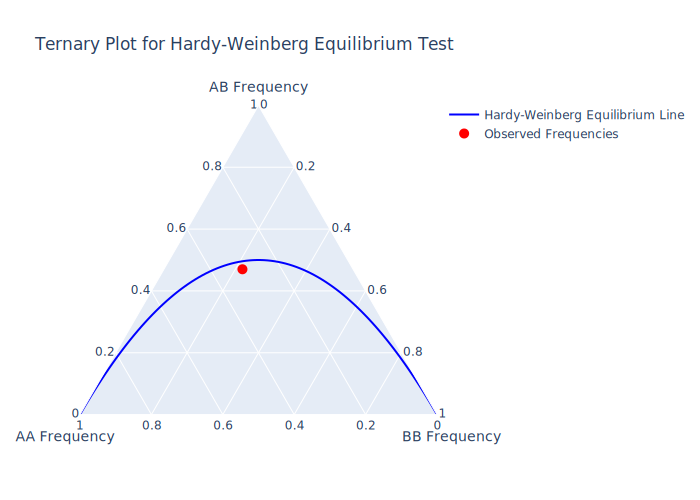

## Genetic Association Analysis


<!-- badges: start -->
[](https://github.com/jinghuazhao/gaawr2/actions/workflows/pages/pages-build-deployment)
[](https://github.com/jinghuazhao/gaawr2/actions/workflows/R-CMD-check.yaml)
<!-- badges: end -->


It gathers information, meta-data and scripts in a two-part Henry-Stewart talk by Zhao (2009, <doi:10.69645/DCRY5578>), which showcases analysis in aspects such as testing of polymorphic variant(s) for Hardy-Weinberg equilibrium, association with trait using genetic and statistical models as well as Bayesian implementation, power calculation in study design and genetic annotation. It also covers R integration with the Linux environment, GitHub, package creation and web applications.

## Installation

The latest version of **gaawr2** can be installed as usual:

### 1. Install from R

```r
# CRAN
install.packages("gaawr2")

# GitHub
if (!requireNamespace("remotes", quietly = TRUE)) install.packages("remotes")
remotes::install_github("jinghuazhao/gaawr2")
```

### 2. Install from GitHub repository

```bash
git clone https://github.com/jinghuazhao/gaawr2
R CMD INSTALL gaawr2
```

Dependencies are detailed in the DECRIPTION file of the package at GitHub.

## A summary of functions

This can be seen from R with

```r
library(help=gaawr2)
```

or

```r
library(gaawr2)
?gaawr2
```
