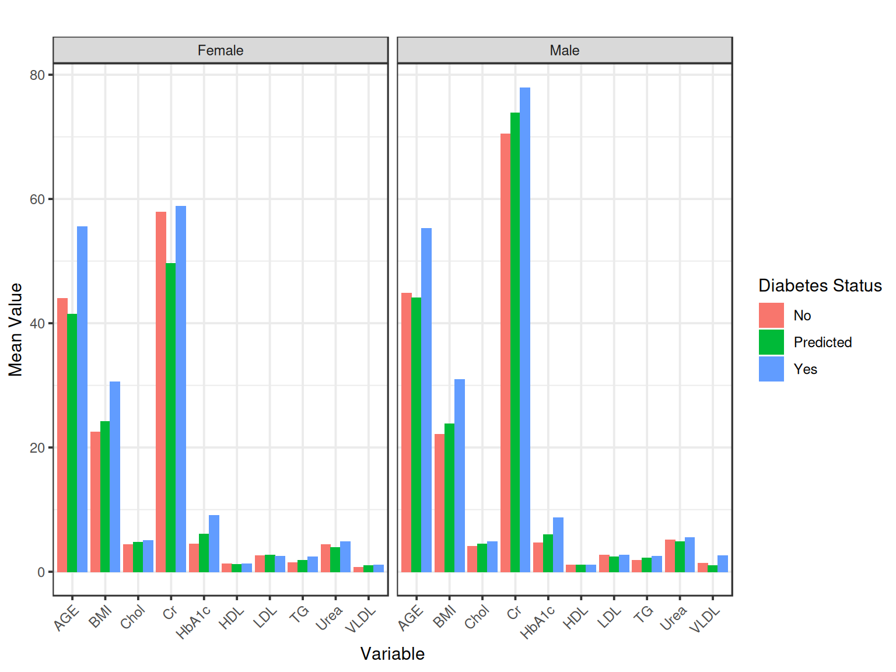
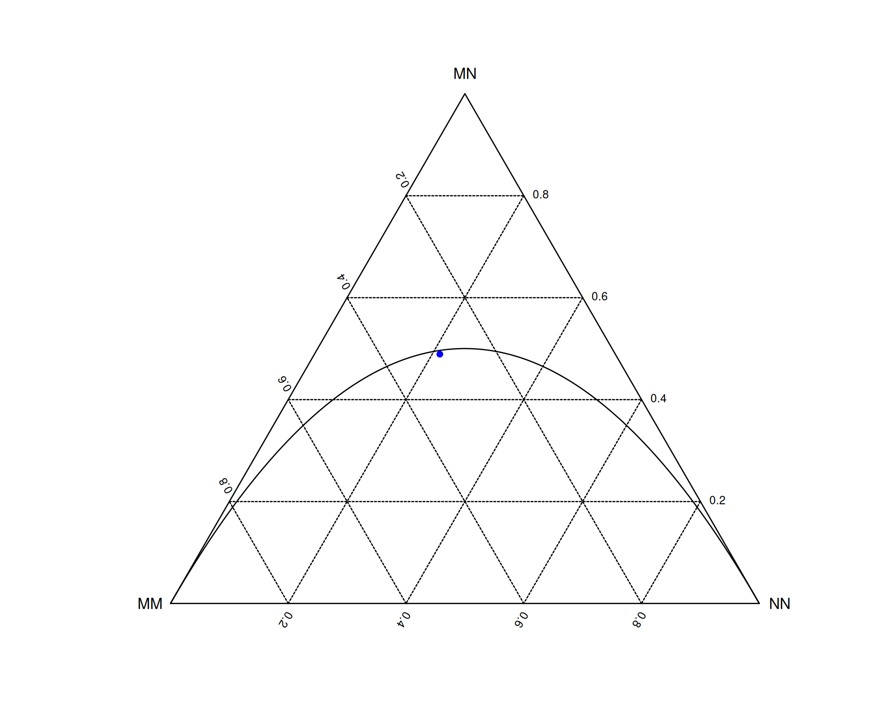
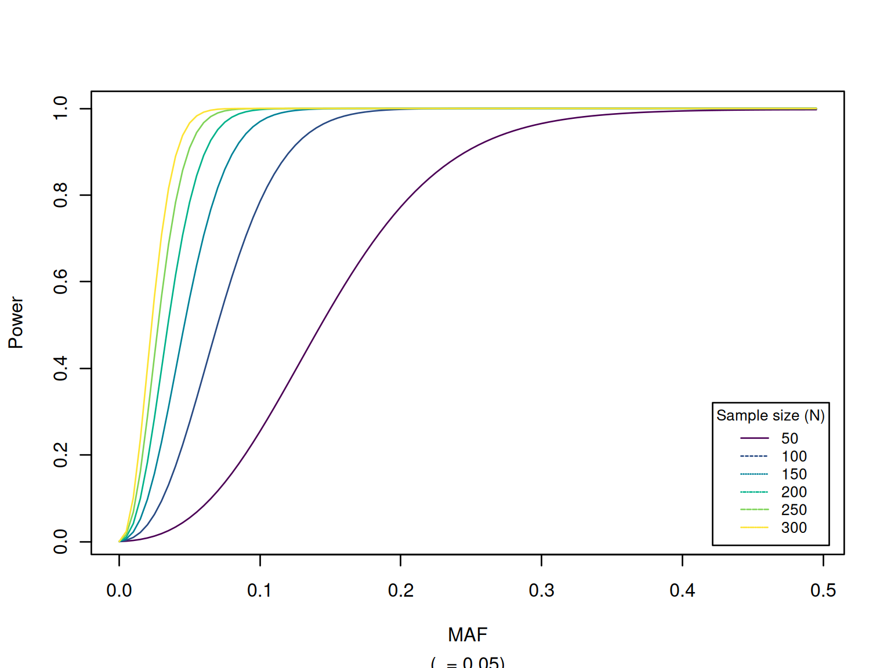

# Genetic Association Analysis

``` r
pkgs <- c("EnsDb.Hsapiens.v75","ensembldb","GMMAT","HardyWeinberg","MCMCglmm","SNPassoc","biomaRt",
           "gap","gap.datasets","haplo.stats","powerEQTL","R2jags","regress",
           "dplyr","ggplot2","httr","jsonlite","kableExtra","knitr","tidyr")
for (p in pkgs) if (length(grep(paste("^package:", p, "$", sep=""), search())) == 0) {
    if (!requireNamespace(p)) warning(paste0("This vignette needs package `", p, "'; please install"))
}
invisible(suppressMessages(lapply(pkgs, require, character.only = TRUE)))
sys_options <- options()
new_options <- options(digits=2)
```

### 0.1 Genetic Association Analysis

This is a companion to Henry-Stewart talk by Zhao (2026,
\<[doi:10.69645/FRFQ9519](https://doi.org/doi:10.69645/FRFQ9519)\>),

which gathers information, metadata and scripts to showcase modern
genetic analysis – ranging from testing

of polymorphic variant(s) for Hardy-Weinberg equilibrium, association
with traits using genetic and statistical

models, Bayesian implementation, power calculation in study design, and
genetic annotation. It also covers

R integration with the Linux environment, GitHub, package creation and
web applications. The earlier version

by Zhao (2009,
\<[doi:10.69645/DCRY5578](https://doi.org/doi:10.69645/DCRY5578)\>) is
also available online and provides an entry-level introduction

to these topics.

It is adapted from pQTLdata, <https://jinghuazhao.github.io/pQTLdata/>.

## 1 Hello, world!

We start with several ways of printting a `Hello, world!` message.

### 1.1 R

R can be started from either command line interface (CLI) or a graphical
user interface (GUI),

``` r
print("Hello, world!\n")
#> [1] "Hello, world!\n"
```

### 1.2 Linux

As it is very powerful, we more often embed R in a Linux script as
follows,

``` bash
export message="Hello, world!"
echo "print('$message')" > hello.R
R CMD BATCH hello.R
R --no-save -q < hello.R
R --no-save -q <<END
message <- Sys.getenv("message"); print(message)
source("hello.R")
END
echo ${message} | \
Rscript -e '
message <- scan("stdin", what="", sep="\n", quiet=TRUE);
write.table(message, col.names=FALSE, row.names=FALSE,
            quote=FALSE)
' | \
cat
rm hello.*
#> > print('Hello, world!')
#> [1] "Hello, world!"
#> > 
#> > message <- Sys.getenv("message"); print(message)
#> [1] "Hello, world!"
#> > source("hello.R")
#> [1] "Hello, world!"
#> > 
#> Hello, world!
```

where the backslash (`\`) is for line continuation.

As shown in the example, one can take advantage of powerful data
handling facilities in the Linux environment, through either Linux
itself or software followed by their counterparts in R with options to
feed back to the Linux envornment again for further use.

Moreover, R could be an integrated component of a workflow, e.g., as
curated in **pQTLtools** involving **snakemake**,
<https://jinghuazhao.github.io/pQTLtools/articles/snakemake.html>.

## 2 Language elements

Basic data manipulation of the `iris` data includes

``` r
class(iris)
#> [1] "data.frame"
dim(iris)
#> [1] 150   5
str(iris)
#> 'data.frame':    150 obs. of  5 variables:
#>  $ Sepal.Length: num  5.1 4.9 4.7 4.6 5 5.4 4.6 5 4.4 4.9 ...
#>  $ Sepal.Width : num  3.5 3 3.2 3.1 3.6 3.9 3.4 3.4 2.9 3.1 ...
#>  $ Petal.Length: num  1.4 1.4 1.3 1.5 1.4 1.7 1.4 1.5 1.4 1.5 ...
#>  $ Petal.Width : num  0.2 0.2 0.2 0.2 0.2 0.4 0.3 0.2 0.2 0.1 ...
#>  $ Species     : Factor w/ 3 levels "setosa","versicolor",..: 1 1 1 1 1 1 1 1 1 1 ...
head(iris,1)
#>   Sepal.Length Sepal.Width Petal.Length Petal.Width Species
#> 1          5.1         3.5          1.4         0.2  setosa
tail(iris,1)
#>     Sepal.Length Sepal.Width Petal.Length Petal.Width   Species
#> 150          5.9           3          5.1         1.8 virginica
```

We would like to highlight two types of operators,

- the scope operator (`::`) is useful since user executes command from a
  particular package without loading it, which is usually faster.
- the native (`|>`) and contributed (`%>%`) pipe operators which enable
  a chained of operations, the latter popularized from R **magrittr**
  and **dplyr** packages

``` r
options(new_options)
data(diabetes,package="gaawr2")

mean_values <- diabetes %>%
  dplyr::filter(CLASS %in% c("Y", "N", "P")) %>%
  dplyr::mutate(
    Gender = dplyr::recode(Gender, "F" = "Female", "M" = "Male"),
    CLASS = dplyr::recode(CLASS, "Y" = "Yes", "N" = "No", "P" = "Predicted")
  ) %>%
  dplyr::group_by(CLASS, Gender) %>%
  dplyr::select(AGE:BMI) %>%
  dplyr::summarize(dplyr::across(dplyr::everything(), \(x) mean(x, na.rm = TRUE)))
#> Adding missing grouping variables: `CLASS`, `Gender`
#> `summarise()` has grouped output by 'CLASS'. You can override using the
#> `.groups` argument.
kableExtra::kbl(mean_values,caption="Mean value by gender and diabetes category") %>%
kableExtra::kable_styling(bootstrap_options = c("striped", "hover"))
```

| CLASS     | Gender |      AGE |     Urea |       Cr |    HbA1c |     Chol |       TG |      HDL |      LDL |      VLDL |      BMI |
|:----------|:-------|---------:|---------:|---------:|---------:|---------:|---------:|---------:|---------:|----------:|---------:|
| No        | Female | 43.98438 | 4.384375 | 57.92188 | 4.501563 | 4.350000 | 1.484375 | 1.326563 | 2.587500 | 0.6906250 | 22.50781 |
| No        | Male   | 44.81579 | 5.142105 | 70.47368 | 4.636842 | 4.126316 | 1.860526 | 1.068421 | 2.684210 | 1.3736842 | 22.09211 |
| Predicted | Female | 41.47059 | 3.876471 | 49.58824 | 6.058823 | 4.747059 | 1.876471 | 1.179412 | 2.655882 | 0.9823529 | 24.17647 |
| Predicted | Male   | 44.13889 | 4.811111 | 73.86111 | 5.977778 | 4.500000 | 2.244444 | 1.102778 | 2.416667 | 0.9833333 | 23.81944 |
| Yes       | Female | 55.56780 | 4.840678 | 58.86158 | 9.104407 | 5.079096 | 2.426554 | 1.304237 | 2.526441 | 1.1115819 | 30.61486 |
| Yes       | Male   | 55.25514 | 5.491858 | 77.91975 | 8.719547 | 4.866502 | 2.476358 | 1.136420 | 2.679383 | 2.6207819 | 30.92420 |

Table 2.1: Mean value by gender and diabetes category

``` r

mean_values_long <- mean_values %>%
  tidyr::pivot_longer(
    cols = AGE:BMI,
    names_to = "Variable",
    values_to = "Mean_Value"
  )
ggplot2::ggplot(mean_values_long,
  ggplot2::aes(x = Variable, y = Mean_Value, fill = CLASS)) +
  ggplot2::geom_col(position = ggplot2::position_dodge()) +
  ggplot2::facet_wrap(~ Gender) +
  ggplot2::labs(
    title = "",
    x = "Variable",
    y = "Mean Value",
    fill = "Diabetes Status" # Modified legend title for clarity
  ) +
  ggplot2::theme_bw() +
  ggplot2::theme(axis.text.x = ggplot2::element_text(angle = 45, hjust = 1))
```



Figure 2.1: Mean values by gender and diabetes category

``` r
options(sys_options)
```

We see higher mean age and HbA1c values in the “Yes” diabetes group as
well as noticeable differences in BMI, which align with the known
associations between these variables and diabetes.

The Comprehensive R Archive Network (CRAN) host and Bioconductor host
many fined-tuned user-contributed packages, their installation is
furnished through

- [`install.packages()`](https://rdrr.io/r/utils/install.packages.html)
  which is a standard way to install from CRAN
- `BiocManager::install() which is the current approach to install package from the Bioconductor project.`
- All packages, including those archived, can be installed with
  `devtools::install_github(cran/package-name)`, e.g., **kinship** and
  **GenABEL**.

## 3 Data analysis

Topics in this section underpins large-scale genome data analysis such
as Genomewide association study (GWAS) and vary from those classic
models such as **mets** for twin data to heavily featured in candidate
gene studies, such as Hardy-Weinberg equilirium (HWE), to GWAS such as
various types of association statistics, QQ/Manhattan/local association
plots.

There has been a lot of interests in machine learning (ML), artificial
language (AI), including deep learning, just to add one more acronym,
the bulk of which is also readily available.

### 3.1 HardyWeinberg

We set to run through the package for HWE. Three data sources are used:
MN blood group in the documentation, a chromosome X SNP and a HLA/DQR,

``` r
# MN blood group
SNP <- c(MM = 298, MN = 489, NN = 213)
HardyWeinberg::maf(SNP)
#>      N 
#> 0.4575
HardyWeinberg::HWTernaryPlot(SNP,region=0,grid=TRUE,markercol="blue")
```



Figure 3.1: SNP ternary plot

``` r
HardyWeinberg::HWChisq(SNP, cc = 0, verbose = TRUE)
#> Chi-square test for Hardy-Weinberg equilibrium (autosomal)
#> Chi2 =    0.2215 DF =    1 p-value =  0.6379 
#>  f =  0.0149 Ho =  0.4890 He =  0.4964
# Chromosome X
xSNP <- c(A=10, B=20, AA=30, AB=20, BB=10)
HardyWeinberg::HWChisq(xSNP,cc=0,x.linked=TRUE,verbose=TRUE)
#> Chi-square test for Hardy-Weinberg equilibrium (X-chromosomal)
#> Chi2 =   14.8611 DF =    2 p-value =  0.0006
# HLA/DQR
DQR <- gap.datasets::hla[,3:4]
a1 <- DQR[1]
a2 <- DQR[2]
GenotypeCounts <- HardyWeinberg::AllelesToTriangular(a1,a2)
kableExtra::kbl(GenotypeCounts,caption="Genotype distribution of DQR") %>%
kableExtra::kable_styling(bootstrap_options = c("striped", "hover"))
```

|     |  A0 |  A1 | A10 | A11 | A12 | A13 | A14 | A15 | A16 | A17 | A18 | A19 |  A2 | A20 | A21 | A22 | A23 | A24 | A25 |  A3 |  A4 |  A6 |  A7 |  A8 |  A9 |
|:----|----:|----:|----:|----:|----:|----:|----:|----:|----:|----:|----:|----:|----:|----:|----:|----:|----:|----:|----:|----:|----:|----:|----:|----:|----:|
| A0  |   1 |   0 |   0 |   0 |   0 |   0 |   0 |   0 |   0 |   0 |   0 |   0 |   0 |   0 |   0 |   0 |   0 |   0 |   0 |   0 |   0 |   0 |   0 |   0 |   0 |
| A1  |   0 |   2 |   0 |   0 |   0 |   0 |   0 |   0 |   0 |   0 |   0 |   0 |   0 |   0 |   0 |   0 |   0 |   0 |   0 |   0 |   0 |   0 |   0 |   0 |   0 |
| A10 |   0 |   2 |   0 |   0 |   0 |   0 |   0 |   0 |   0 |   0 |   0 |   0 |   0 |   0 |   0 |   0 |   0 |   0 |   0 |   0 |   0 |   0 |   0 |   0 |   0 |
| A11 |   0 |   0 |   0 |   0 |   0 |   0 |   0 |   0 |   0 |   0 |   0 |   0 |   0 |   0 |   0 |   0 |   0 |   0 |   0 |   0 |   0 |   0 |   0 |   0 |   0 |
| A12 |   0 |   0 |   0 |   0 |   0 |   0 |   0 |   0 |   0 |   0 |   0 |   0 |   0 |   0 |   0 |   0 |   0 |   0 |   0 |   0 |   0 |   0 |   0 |   0 |   0 |
| A13 |   0 |   0 |   0 |   0 |   0 |   1 |   0 |   0 |   0 |   0 |   0 |   0 |   0 |   0 |   0 |   0 |   0 |   0 |   0 |   0 |   0 |   0 |   0 |   0 |   0 |
| A14 |   0 |   3 |   2 |   0 |   2 |   1 |   2 |   0 |   0 |   0 |   0 |   0 |   0 |   0 |   0 |   0 |   0 |   0 |   0 |   0 |   0 |   0 |   0 |   0 |   0 |
| A15 |   0 |   3 |   0 |   0 |   0 |   0 |   0 |   0 |   0 |   0 |   0 |   0 |   0 |   0 |   0 |   0 |   0 |   0 |   0 |   0 |   0 |   0 |   0 |   0 |   0 |
| A16 |   0 |   1 |   1 |   0 |   0 |   0 |   1 |   1 |   0 |   0 |   0 |   0 |   0 |   0 |   0 |   0 |   0 |   0 |   0 |   0 |   0 |   0 |   0 |   0 |   0 |
| A17 |   0 |   0 |   1 |   0 |   1 |   2 |   1 |   0 |   0 |   3 |   0 |   0 |   0 |   0 |   0 |   0 |   0 |   0 |   0 |   0 |   0 |   0 |   0 |   0 |   0 |
| A18 |   0 |   1 |   0 |   0 |   0 |   0 |   0 |   1 |   0 |   1 |   0 |   0 |   0 |   0 |   0 |   0 |   0 |   0 |   0 |   0 |   0 |   0 |   0 |   0 |   0 |
| A19 |   0 |   0 |   0 |   0 |   0 |   0 |   0 |   0 |   0 |   1 |   1 |   0 |   0 |   0 |   0 |   0 |   0 |   0 |   0 |   0 |   0 |   0 |   0 |   0 |   0 |
| A2  |   0 |   0 |   0 |   0 |   0 |   0 |   1 |   0 |   0 |   0 |   0 |   0 |   0 |   0 |   0 |   0 |   0 |   0 |   0 |   0 |   0 |   0 |   0 |   0 |   0 |
| A20 |   0 |   0 |   0 |   0 |   0 |   0 |   0 |   0 |   1 |   0 |   0 |   0 |   0 |   0 |   0 |   0 |   0 |   0 |   0 |   0 |   0 |   0 |   0 |   0 |   0 |
| A21 |   0 |   3 |   0 |   0 |   0 |   0 |   1 |   0 |   1 |   0 |   0 |   0 |   0 |   0 |   0 |   0 |   0 |   0 |   0 |   0 |   0 |   0 |   0 |   0 |   0 |
| A22 |   0 |  13 |   3 |   0 |   0 |   1 |   3 |   0 |   0 |   4 |   0 |   1 |   0 |   1 |   2 |   5 |   0 |   0 |   0 |   0 |   0 |   0 |   0 |   0 |   0 |
| A23 |   0 |   0 |   0 |   0 |   0 |   0 |   0 |   0 |   0 |   0 |   0 |   0 |   0 |   0 |   0 |   1 |   0 |   0 |   0 |   0 |   0 |   0 |   0 |   0 |   0 |
| A24 |   0 |   1 |   0 |   0 |   0 |   0 |   0 |   0 |   0 |   2 |   0 |   0 |   0 |   0 |   0 |   0 |   0 |   0 |   0 |   0 |   0 |   0 |   0 |   0 |   0 |
| A25 |   0 |   0 |   1 |   0 |   0 |   0 |   0 |   0 |   0 |   0 |   0 |   0 |   0 |   0 |   0 |   0 |   0 |   0 |   0 |   0 |   0 |   0 |   0 |   0 |   0 |
| A3  |   0 |   1 |   0 |   0 |   0 |   0 |   0 |   0 |   0 |   0 |   0 |   0 |   1 |   0 |   0 |   3 |   1 |   0 |   0 |   1 |   0 |   0 |   0 |   0 |   0 |
| A4  |   0 |   3 |   3 |   0 |   2 |   0 |   3 |   0 |   1 |   2 |   1 |   0 |   1 |   1 |   3 |   8 |   0 |   1 |   0 |   3 |   4 |   0 |   0 |   0 |   0 |
| A6  |   0 |   6 |   0 |   0 |   1 |   0 |   3 |   0 |   0 |   3 |   1 |   0 |   0 |   0 |   2 |   7 |   1 |   0 |   0 |   0 |  11 |   7 |   0 |   0 |   0 |
| A7  |   0 |   0 |   0 |   0 |   0 |   0 |   0 |   0 |   0 |   1 |   0 |   0 |   0 |   0 |   0 |   0 |   0 |   0 |   0 |   1 |   2 |   0 |   1 |   0 |   0 |
| A8  |   0 |   3 |   1 |   0 |   1 |   0 |   5 |   0 |   0 |   1 |   1 |   0 |   0 |   0 |   0 |   9 |   2 |   0 |   0 |   1 |   4 |   2 |   1 |   2 |   0 |
| A9  |   0 |   8 |   2 |   1 |   0 |   2 |   3 |   0 |   0 |   5 |   2 |   0 |   0 |   0 |   3 |  15 |   1 |   0 |   0 |   1 |   7 |  10 |   1 |   4 |   2 |

Table 3.1: Genotype distribution of DQR

``` r
HardyWeinberg::HWPerm.mult(GenotypeCounts,nperm=300)
#> Permutation test for Hardy-Weinberg equilibrium (autosomal).
#> 25 alleles detected.
#> Observed statistic: 1.461325e-84   300 permutations. p-value: 0.01
HardyWeinberg::HWStr(hla[,3:4],test="permutation",nperm=300)
#> 1 STRs detected.
#>      STR   N Nt     MinorAF   MajorAF        Ho        He       Hp       pval
#> 1 DQR.a1 271 25 0.001845018 0.1494465 0.8856089 0.9097643 2.654949 0.02666667
```

The MN locus is seen to be close to the HWE line from the ternary plot.
Only 300 permutations are done for the HLA/DQR data to illustrate.

### 3.2 SNPassoc

The package implements procedures which are appropriate for candidate
gene association analysis, under a variety of genetic models.

We first look at some meta-data, include HWE.

``` r
data(asthma, package = "SNPassoc")
str(asthma, list.len=8)
#> 'data.frame':    1578 obs. of  57 variables:
#>  $ country    : Factor w/ 10 levels "Australia","Belgium",..: 5 5 5 5 5 5 5 5 5 5 ...
#>  $ gender     : Factor w/ 2 levels "Females","Males": 2 2 2 1 1 1 1 2 1 1 ...
#>  $ age        : num  42.8 50.2 46.7 47.9 48.4 ...
#>  $ bmi        : num  20.1 24.7 27.7 33.3 25.2 ...
#>  $ smoke      : int  1 0 0 0 0 1 0 0 0 0 ...
#>  $ casecontrol: int  0 0 0 0 1 0 0 0 0 0 ...
#>  $ rs4490198  : Factor w/ 3 levels "AA","AG","GG": 3 3 3 2 2 2 3 2 2 2 ...
#>  $ rs4849332  : Factor w/ 3 levels "GG","GT","TT": 3 2 3 2 1 2 3 3 2 1 ...
#>   [list output truncated]
knitr::kable(asthma[1:3,1:8],caption="First three records & two SNPs")
```

| country | gender |      age |      bmi | smoke | casecontrol | rs4490198 | rs4849332 |
|:--------|:-------|---------:|---------:|------:|------------:|:----------|:----------|
| Germany | Males  | 42.80630 | 20.14797 |     1 |           0 | GG        | TT        |
| Germany | Males  | 50.22861 | 24.69136 |     0 |           0 | GG        | GT        |
| Germany | Males  | 46.68857 | 27.73230 |     0 |           0 | GG        | TT        |

Table 3.2: First three records & two SNPs

``` r
snpCols <- colnames(asthma)[6+(1:2)]
snps <- SNPassoc::setupSNP(data=asthma[snpCols], colSNPs=1:length(snpCols), sep="")
head(snps)
#>   rs4490198 rs4849332
#> 1       G/G       T/T
#> 2       G/G       G/T
#> 3       G/G       T/T
#> 4       A/G       G/T
#> 5       A/G       G/G
#> 6       A/G       G/T
summary(snps, print=FALSE)
#>           alleles major.allele.freq HWE      missing (%)
#> rs4490198 A/G     59.2              0.174133 0.6        
#> rs4849332 G/T     61.8              0.522060 0.1
lapply(snps, head)
#> $rs4490198
#> [1] G/G G/G G/G A/G A/G A/G
#> Genotypes: A/A A/G G/G
#> Alleles:  G A 
#> 
#> $rs4849332
#> [1] T/T G/T T/T G/T G/G G/T
#> Genotypes: G/G G/T T/T
#> Alleles:  T G
lapply(snps, summary)
#> $rs4490198
#> Genotypes: 
#>      frequency percentage
#> A/A        562   35.84184
#> A/G        731   46.61990
#> G/G        275   17.53827
#> NA's        10           
#> 
#> Alleles: 
#>      frequency percentage
#> G         1281   40.84821
#> A         1855   59.15179
#> NA's        20           
#> 
#> HWE (p value): 0.1741325 
#> 
#> $rs4849332
#> Genotypes: 
#>      frequency percentage
#> G/G        609   38.61763
#> G/T        732   46.41725
#> T/T        236   14.96512
#> NA's         1           
#> 
#> Alleles: 
#>      frequency percentage
#> T         1204   38.17375
#> G         1950   61.82625
#> NA's         2           
#> 
#> HWE (p value): 0.5220596
SNPassoc::tableHWE(snps)
#>           HWE (p value) flag
#> rs4490198 0.1741            
#> rs4849332 0.5221
```

where variable `snpCols` skips six columns of non-SNP data for two SNPs.

We then turn to genetic models for the first one,

``` r
asthma.snps <- asthma %>%
               dplyr::rename(cc=casecontrol) %>%
               SNPassoc::setupSNP(colSNPs=(6+1):ncol(.), sep="")
# Model 1: Simple SNP association with BMI
SNPassoc::association(bmi ~ rs4490198, data = asthma.snps)
#> 
#> SNP: rs4490198  adjusted by: 
#>                 n    me     se      dif   lower  upper p-value  AIC
#> Codominant                                                         
#> A/A           558 25.54 0.1764  0.00000                 0.8847 9015
#> A/G           725 25.56 0.1741  0.02169 -0.4614 0.5048             
#> G/G           273 25.41 0.2369 -0.12986 -0.7634 0.5037             
#> Dominant                                                           
#> A/A           558 25.54 0.1764  0.00000                 0.9319 9013
#> A/G-G/G       998 25.52 0.1421 -0.01977 -0.4731 0.4336             
#> Recessive                                                          
#> A/A-A/G      1283 25.55 0.1247  0.00000                 0.6261 9013
#> G/G           273 25.41 0.2369 -0.14212 -0.7137 0.4294             
#> Overdominant                                                       
#> A/A-G/G       831 25.50 0.1417  0.00000                 0.7723 9013
#> A/G           725 25.56 0.1741  0.06435 -0.3715 0.5002             
#> log-Additive                                                       
#> 0,1,2                          -0.05016 -0.3575 0.2571  0.7491 9013

# Model 2: SNP association with case-control status
SNPassoc::association(cc ~ rs4490198, data = asthma.snps)
#> 
#> SNP: rs4490198  adjusted by: 
#>                 0    %   1    %   OR lower upper p-value  AIC
#> Codominant                                                   
#> A/A           449 36.5 113 33.4 1.00              0.5277 1639
#> A/G           565 45.9 166 49.1 1.17  0.89  1.53             
#> G/G           216 17.6  59 17.5 1.09  0.76  1.55             
#> Dominant                                                     
#> A/A           449 36.5 113 33.4 1.00              0.2950 1638
#> A/G-G/G       781 63.5 225 66.6 1.14  0.89  1.48             
#> Recessive                                                    
#> A/A-A/G      1014 82.4 279 82.5 1.00              0.9640 1639
#> G/G           216 17.6  59 17.5 0.99  0.72  1.36             
#> Overdominant                                                 
#> A/A-G/G       665 54.1 172 50.9 1.00              0.3000 1638
#> A/G           565 45.9 166 49.1 1.14  0.89  1.45             
#> log-Additive                                                 
#> 0,1,2        1230 78.4 338 21.6 1.06  0.90  1.26  0.4951 1638

# Model 3: SNP association with covariates (country and smoke)
SNPassoc::association(cc ~ rs4490198 + country + smoke, data = asthma.snps)
#> 
#> SNP: rs4490198  adjusted by: country smoke 
#>                 0    %   1    %   OR lower upper p-value  AIC
#> Codominant                                                   
#> A/A           448 36.6 112 33.2 1.00              0.5414 1403
#> A/G           563 46.0 166 49.3 1.18  0.88  1.59             
#> G/G           213 17.4  59 17.5 1.08  0.73  1.60             
#> Dominant                                                     
#> A/A           448 36.6 112 33.2 1.00              0.3172 1401
#> A/G-G/G       776 63.4 225 66.8 1.15  0.87  1.52             
#> Recessive                                                    
#> A/A-A/G      1011 82.6 278 82.5 1.00              0.9091 1402
#> G/G           213 17.4  59 17.5 0.98  0.69  1.39             
#> Overdominant                                                 
#> A/A-G/G       661 54.0 171 50.7 1.00              0.2983 1401
#> A/G           563 46.0 166 49.3 1.15  0.88  1.50             
#> log-Additive                                                 
#> 0,1,2        1224 78.4 337 21.6 1.06  0.88  1.28  0.5382 1402

# Model 4: SNP association with stratification by gender
SNPassoc::association(cc ~ rs4490198 + survival::strata(gender), data = asthma.snps)
#> 
#> SNP: rs4490198  adjusted by: survival::strata(gender) 
#>                 0    %   1    %   OR lower upper p-value  AIC
#> Codominant                                                   
#> A/A           449 36.5 113 33.4 1.00              0.5523 1630
#> A/G           565 45.9 166 49.1 1.16  0.89  1.52             
#> G/G           216 17.6  59 17.5 1.10  0.77  1.57             
#> Dominant                                                     
#> A/A           449 36.5 113 33.4 1.00              0.2948 1629
#> A/G-G/G       781 63.5 225 66.6 1.15  0.89  1.48             
#> Recessive                                                    
#> A/A-A/G      1014 82.4 279 82.5 1.00              0.9417 1630
#> G/G           216 17.6  59 17.5 1.01  0.74  1.39             
#> Overdominant                                                 
#> A/A-G/G       665 54.1 172 50.9 1.00              0.3435 1629
#> A/G           565 45.9 166 49.1 1.12  0.88  1.43             
#> log-Additive                                                 
#> 0,1,2        1230 78.4 338 21.6 1.07  0.90  1.27  0.4546 1629

# Model 5: SNP association with subset (only Spain)
SNPassoc::association(cc ~ rs4490198, data = asthma.snps, subset = country == "Spain")
#> 
#> SNP: rs4490198  adjusted by: 
#>                0    %  1    %   OR lower upper p-value   AIC
#> Codominant                                                  
#> A/A          141 43.3 18 37.5 1.00              0.6257 291.7
#> A/G          145 44.5 22 45.8 1.19  0.61  2.31              
#> G/G           40 12.3  8 16.7 1.57  0.63  3.87              
#> Dominant                                                    
#> A/A          141 43.3 18 37.5 1.00              0.4494 290.1
#> A/G-G/G      185 56.7 30 62.5 1.27  0.68  2.37              
#> Recessive                                                   
#> A/A-A/G      286 87.7 40 83.3 1.00              0.4104 290.0
#> G/G           40 12.3  8 16.7 1.43  0.62  3.27              
#> Overdominant                                                
#> A/A-G/G      181 55.5 26 54.2 1.00              0.8602 290.6
#> A/G          145 44.5 22 45.8 1.06  0.57  1.94              
#> log-Additive                                                
#> 0,1,2        326 87.2 48 12.8 1.24  0.80  1.91  0.3394 289.7

# Model 6: Interaction between SNP (dominant model) and smoking
SNPassoc::association(cc ~ SNPassoc::dominant(rs4490198) * factor(smoke), data = asthma.snps)
#> 
#>       SNP: SNPassoc::dominant(rs4490198  adjusted by: 
#>  Interaction 
#> ---------------------
#>           0       OR lower upper   1      OR lower upper
#> A/A     293  84 1.00    NA    NA 155 28 0.63  0.39  1.01
#> A/G-G/G 539 172 1.11  0.83   1.5 237 53 0.78  0.53  1.15
#> 
#> p interaction: 0.71994 
#> 
#>  factor(smoke) within SNPassoc::dominant(rs4490198 
#> ---------------------
#> A/A 
#>     0  1   OR lower upper
#> 0 293 84 1.00    NA    NA
#> 1 155 28 0.63  0.39  1.01
#> 
#> A/G-G/G 
#>     0   1  OR lower upper
#> 0 539 172 1.0    NA    NA
#> 1 237  53 0.7   0.5  0.99
#> 
#> p trend: 0.71994 
#> 
#>  SNPassoc::dominant(rs4490198 within factor(smoke) 
#> ---------------------
#> 0 
#>           0   1   OR lower upper
#> A/A     293  84 1.00    NA    NA
#> A/G-G/G 539 172 1.11  0.83   1.5
#> 
#> 1 
#>           0  1   OR lower upper
#> A/A     155 28 1.00    NA    NA
#> A/G-G/G 237 53 1.24  0.75  2.04
#> 
#> p trend: 0.71994

# Model 7: Interaction between two SNPs (dominant model for rs4490198)
SNPassoc::association(cc ~ rs4490198 * factor(rs11123242), data = asthma.snps, model.interaction = "dominant")
#> 
#>       SNP: rs4490198  adjusted by: 
#>  Interaction 
#> ---------------------
#>         C/C       OR lower upper C/T       OR lower upper  0  1  T/T lower
#> A/A     448 113 1.00    NA    NA   1   0 0.00  0.00    NA  0  0   NA    NA
#> A/G-G/G 371 109 1.16  0.87  1.57 365 102 1.11  0.82   1.5 39 14 1.42  0.75
#>         upper
#> A/A        NA
#> A/G-G/G  2.71
#> 
#> p interaction: 0.5126 
#> 
#>  factor(rs11123242) within rs4490198 
#> ---------------------
#> A/A 
#>       0   1 OR lower upper
#> C/C 448 113  1    NA    NA
#> C/T   1   0  0     0    NA
#> T/T   0   0 NA    NA    NA
#> 
#> A/G-G/G 
#>       0   1   OR lower upper
#> C/C 371 109 1.00    NA    NA
#> C/T 365 102 0.95  0.70  1.29
#> T/T  39  14 1.22  0.64  2.33
#> 
#> p trend: 0.5126 
#> 
#>  rs4490198 within factor(rs11123242) 
#> ---------------------
#> C/C 
#>           0   1   OR lower upper
#> A/A     448 113 1.00    NA    NA
#> A/G-G/G 371 109 1.16  0.87  1.57
#> 
#> C/T 
#>           0   1 OR lower upper
#> A/A       1   0  1    NA    NA
#> A/G-G/G 365 102 NA     0    NA
#> 
#> T/T 
#>          0  1 OR lower upper
#> A/A      0  0  1    NA    NA
#> A/G-G/G 39 14 NA    NA    NA
#> 
#> p trend: 0.49958
```

### 3.3 haplo.stats

This package considers haplotype estimation using EM-algorithms and
genetic association under a generalized linear model (GLM).

``` r
# Association with the first three SNPs
snpsH <- names(asthma.snps)[6+(1:3)]
genoH <- SNPassoc::make.geno(asthma.snps, snpsH)
em <- haplo.stats::haplo.em(genoH, locus.label = snpsH, miss.val = c(0, NA))
haplo_table <- with(em,cbind(haplotype,hap.prob))
knitr::kable(haplo_table,caption="Haplotypes of the first three SNPs")
```

| rs4490198 | rs4849332 | rs1367179 |  hap.prob |
|:----------|:----------|:----------|----------:|
| 1         | 1         | 1         | 0.0003813 |
| 1         | 1         | 2         | 0.5593910 |
| 1         | 2         | 1         | 0.0004027 |
| 1         | 2         | 2         | 0.0306653 |
| 2         | 1         | 1         | 0.0000000 |
| 2         | 1         | 2         | 0.0584815 |
| 2         | 2         | 1         | 0.1851431 |
| 2         | 2         | 2         | 0.1655351 |

Table 3.3: Haplotypes of the first three SNPs

``` r
modH <- haplo.stats::haplo.glm(cc ~ genoH, data=asthma.snps,
                               family="binomial",
                               locus.label=snpsH,
                               allele.lev=attributes(genoH)$unique.alleles,
                               control = haplo.stats::haplo.glm.control(haplo.freq.min=0.05))
modH
#> 
#> Call:  haplo.stats::haplo.glm(formula = cc ~ genoH, family = "binomial", 
#>     data = asthma.snps, locus.label = snpsH, control = haplo.stats::haplo.glm.control(haplo.freq.min = 0.05), 
#>     allele.lev = attributes(genoH)$unique.alleles)
#> 
#> Coefficients:
#> (Intercept)      genoH.6      genoH.7      genoH.8   genoH.rare  
#>   -1.322930     0.161274     0.083020    -0.027472    -0.191619  
#> 
#> Haplotypes:
#>            rs4490198 rs4849332 rs1367179 hap.freq
#> genoH.6            G         G         G 0.058479
#> genoH.7            G         T         C 0.185124
#> genoH.8            G         T         G 0.165551
#> genoH.rare         *         *         * 0.031456
#> haplo.base         A         G         G 0.559391
#> 
#> Degrees of Freedom:  1577 Total (i.e. Null);  1573 Residual
#> 
#>      Null Deviance:  1644.6 
#>  Residual Deviance:  1642.6 
#>                AIC:  1652.6
SNPassoc::intervals(modH)
#>                freq   or   95%   C.I.   P-val 
#>          AGG 0.5594   1.00 Reference haplotype 
#>          GGG 0.0585   1.18 (   0.81 -   1.70 )  0.3937 
#>          GTC 0.1851   1.09 (   0.87 -   1.36 )  0.4669 
#>          GTG 0.1656   0.97 (   0.77 -   1.23 )  0.8198 
#>   genoH.rare 0.0315   0.83 (   0.47 -   1.44 )  0.5003

# Model comparison with / without haplotypes
mod.adj.ref <- glm(cc ~ smoke, data=asthma.snps, family="binomial")
mod.adj <- haplo.glm(cc ~ genoH + smoke, data=asthma.snps,
                 family="binomial",
                 locus.label=snpsH,
                 allele.lev=attributes(genoH3)$unique.alleles,
                 control = haplo.stats::haplo.glm.control(haplo.freq.min=0.05))
mod.adj
#> 
#> Call:  haplo.glm(formula = cc ~ genoH + smoke, family = "binomial", 
#>     data = asthma.snps, locus.label = snpsH, control = haplo.stats::haplo.glm.control(haplo.freq.min = 0.05), 
#>     allele.lev = attributes(genoH3)$unique.alleles)
#> 
#> Coefficients:
#> (Intercept)      genoH.6      genoH.7      genoH.8   genoH.rare        smoke  
#>   -1.216221     0.144485     0.092058    -0.024518    -0.170104    -0.390860  
#> 
#> Haplotypes:
#>            rs4490198 rs4849332 rs1367179 hap.freq
#> genoH.6            G         G         G 0.058406
#> genoH.7            G         T         C 0.184673
#> genoH.8            G         T         G 0.165351
#> genoH.rare         *         *         * 0.031263
#> haplo.base         A         G         G 0.560307
#> 
#> Degrees of Freedom:  1570 Total (i.e. Null);  1565 Residual
#> 
#> Subjects removed by NAs in y or x, or all NA in geno
#>   yxmiss genomiss 
#>        7        0 
#> 
#>      Null Deviance:  1638.6 
#>  Residual Deviance:  1628.6 
#>                AIC:  1640.6
lrt.adj <- mod.adj.ref$deviance - mod.adj$deviance
pchisq(lrt.adj, mod.adj$lrt$df, lower=FALSE)
#> [1] 0.8682086

# Four variable slide windows over nine SNPs
snpsH <- labels(asthma.snps)[6+(1:9)]
genoH <- SNPassoc::make.geno(asthma.snps, snpsH)
haploH <- list()
for (i in 1:4) haploH[[i]] <- haplo.stats::haplo.score.slide(asthma.snps$cc, genoH,
                              trait.type="binomial",
                              n.slide=i,
                              locus.label=snpsH,
                              simulate=TRUE,
                              sim.control=haplo.stats::score.sim.control(min.sim=50,max.sim=100))
```

### 3.4 GWAS

We return to the asthma data used in **SNPassoc**.

``` r
assoc <- SNPassoc::WGassociation(cc, data=asthma.snps)
assoc.adj <- SNPassoc::WGassociation(cc ~ country + smoke, asthma.snps)
assoc.maxstat <- SNPassoc::maxstat(asthma.snps, cc)
assoc %>%
  as.data.frame() %>%
  dplyr::select(-comments) %>%
  knitr::kable(caption="SNP association")
assoc.adj %>%
  as.data.frame() %>%
  dplyr::select(-comments) %>%
  knitr::kable(caption="with adjustment for contountry & smoking")
assoc.maxstat %>%
  `[`(,) %>%
  t() %>%
  knitr::kable(caption = "Max stat association statistics")
```

where assoc.maxstat is coerced into a matrix later, but there appears
problematic to knit though.

### 3.5 GMMAT

The following is modified slightly from the package vignette,

``` r
data(example,package="GMMAT")
attach(example)
model0 <- GMMAT::glmmkin(disease ~ age + sex, data = pheno, kins = GRM,
                         id = "id", family = binomial(link = "logit"))
model1 <- GMMAT::glmmkin(fixed = trait ~ age + sex, data = pheno, kins = GRM,
                         id = "id", family = gaussian(link = "identity"))
model2 <- GMMAT::glmmkin(fixed = trait ~ age + sex, data = pheno, kins = GRM,
                         id = "id", groups = "disease",
                         family = gaussian(link = "identity"))
snps <- c("SNP10", "SNP25", "SNP1", "SNP0")
geno.file <- system.file("extdata", "geno.bgen", package = "GMMAT")
samplefile <- system.file("extdata", "geno.sample", package = "GMMAT")
outfile <- "glmm.score.txt"
GMMAT::glmm.score(model0, infile = geno.file, BGEN.samplefile = samplefile,
                  outfile = outfile)
read.delim(outfile) |>
     head(n=4) |>
     knitr::kable(caption="Score tests under GLMM on four SNPs",digits=2)
```

| SNP  | RSID | CHR | POS | A1  | A2  |   N |   AF | SCORE |   VAR | PVAL |
|:-----|:-----|----:|----:|:----|:----|----:|-----:|------:|------:|-----:|
| SNP1 | SNP1 |   1 |   1 | T   | A   | 393 | 0.97 | -1.99 |  4.56 | 0.35 |
| SNP2 | SNP2 |   1 |   2 | A   | C   | 400 | 0.50 |  3.51 | 46.33 | 0.61 |
| SNP3 | SNP3 |   1 |   3 | C   | A   | 400 | 0.79 |  0.53 | 30.60 | 0.92 |
| SNP4 | SNP4 |   1 |   4 | G   | A   | 400 | 0.70 |  3.11 | 40.51 | 0.62 |

Table 3.4: Score tests under GLMM on four SNPs

``` r
unlink(outfile)
bed.file <- system.file("extdata", "geno.bed", package = "GMMAT") |>
            tools::file_path_sans_ext()
model.wald <- GMMAT::glmm.wald(fixed = disease ~ age + sex, data = pheno,
                               kins = GRM, id = "id", family = binomial(link = "logit"),
                               infile = bed.file, snps = snps)
knitr::kable(model.wald,caption="Wald tests under GLMM on four SNPs")
```

| CHR | SNP   | cM  | POS | A1  | A2  |   N |        AF |       BETA |        SE |      PVAL | converged |
|:----|:------|:----|:----|:----|:----|----:|----------:|-----------:|----------:|----------:|:----------|
| 1   | SNP10 | 0   | 10  | G   | A   | 400 | 0.7675000 |  0.1397665 | 0.1740090 | 0.4218510 | TRUE      |
| 1   | SNP25 | 0   | 25  | C   | A   | 400 | 0.8250000 |  0.0292076 | 0.1934447 | 0.8799861 | TRUE      |
| 1   | SNP1  | 0   | 1   | T   | A   | 393 | 0.9745547 | -0.4566064 | 0.4909946 | 0.3523907 | TRUE      |
| NA  | SNP0  | NA  | NA  | NA  | NA  |  NA |        NA |         NA |        NA |        NA | NA        |

Table 3.4: Wald tests under GLMM on four SNPs

``` r
detach(example)
```

where both BGEN and PLINK binary file are illustrated.

### 3.6 h2.jags

The function uses JAGS (<https://mcmc-jags.sourceforge.io/>) for
heritability estimation¹,

``` r
set.seed(1234567)
meyer <- within(gap.datasets::meyer,{
         y[is.na(y)] <- rnorm(length(y[is.na(y)]),mean(y,na.rm=TRUE),sd(y,na.rm=TRUE))
         g1 <- ifelse(generation==1,1,0)
         g2 <- ifelse(generation==2,1,0)
         id <- animal
         animal <- ifelse(!is.na(animal),animal,0)
         dam <- ifelse(!is.na(dam),dam,0)
         sire <- ifelse(!is.na(sire),sire,0)
     })
G <- gap::kin.morgan(meyer)$kin.matrix*2
r <- regress::regress(y~-1+g1+g2,~G,data=meyer)
r
#> Likelihood kernel: K = g1+g2
#> 
#> Maximized log likelihood with kernel K is  -843.962 
#> 
#> Linear Coefficients:
#>     Estimate Std. Error
#>  g1  222.994      1.429
#>  g2  238.558      1.760
#> 
#> Variance Coefficients:
#>     Estimate Std. Error
#>  G    31.672     13.777
#>  In   72.419     10.182
with(r,gap::h2G(sigma,sigma.cov))
#> Vp = 104.091 SE = 9.925092 
#> h2G = 0.3042677 SE = 0.1147779
eps <- 0.001
y <- with(meyer,y)
x <- with(meyer,cbind(g1,g2))
ex <- gap::h2.jags(y,x,G,sigma.p=0.03,sigma.r=0.014,n.chains=1,n.iter=80)
#> Compiling model graph
#>    Resolving undeclared variables
#>    Allocating nodes
#> Graph information:
#>    Observed stochastic nodes: 306
#>    Unobserved stochastic nodes: 310
#>    Total graph size: 95805
#> 
#> Initializing model
kableExtra::kbl(ex$BUGSoutput$summary,digits=2,caption="MCMC results for the Meyer data") %>%
kableExtra::kable_styling(bootstrap_options = c("striped", "hover"))
```

|          |    mean |    sd |    2.5% |     25% |     50% |     75% |   97.5% |
|:---------|--------:|------:|--------:|--------:|--------:|--------:|--------:|
| b\[1\]   |  222.19 |  1.30 |  219.79 |  221.81 |  222.13 |  222.79 |  224.78 |
| b\[2\]   |  237.55 |  1.67 |  234.67 |  236.62 |  237.46 |  238.76 |  240.59 |
| deviance | 2181.50 | 22.18 | 2141.86 | 2166.83 | 2181.90 | 2197.92 | 2218.65 |
| h2       |    0.30 |  0.07 |    0.19 |    0.25 |    0.31 |    0.36 |    0.44 |
| p        |   32.05 |  8.48 |   19.03 |   25.03 |   32.30 |   38.19 |   43.51 |
| r        |   72.73 |  8.12 |   61.56 |   66.39 |   71.99 |   79.09 |   87.36 |

Table 3.5: MCMC results for the Meyer data

To avoid multithread and excessive time for CRAN checking, only one
chain and 80 iterations are run, 40 of which are burn-ins and every
iteraction is kept (n.thin=1).

### 3.7 powerEQTL

Consider `powereQTL.SLR` (simple linear regression) for a sample size of
50-300 by 50, minor allele frequencies 0.005~0.5, \\\alpha\\=0.05. We
have,

``` r
n.designs <- 6
designs <- 1:n.designs
N <- 50 * designs
n.grids <- 100
index <- 1:n.grids
grids <- index / n.grids
MAF <- seq(0.005, n.grids/2, by=0.5) / n.grids
plot(MAF,grids,type="n",ylab="Power")
mtext(expression(paste("(",alpha," = 0.05)")),1,line=4.5)
colors <- grDevices::hcl.colors(n.designs)
for (design in designs)
{
  power.SLR <- rep(NA,n.grids)
  for (j in index) power.SLR[j] <- powerEQTL::powerEQTL.SLR(MAF = MAF[j], FWER = 0.05, nTests = 240, slope = 0.13,
                                                            n = N[design], sigma.y = 0.13)
  lines(MAF,power.SLR,col=colors[design])
}
legend("bottomright", inset=.02, title="Sample size (N)", paste(N), col=colors, horiz=FALSE, cex=0.8, lty=designs)
```



Figure 3.2: Power Estimation for eQTL Studies of 240 SNPs

The counterpart for single-cell RNA-Seq design is via
`powerEQTL.scRNAseq`.

## 4 Annotations

### 4.1 EnsDb.Hsapiens.v75

``` r
ensembldb::metadata(EnsDb.Hsapiens.v75)
#>                  name                               value
#> 1             Db type                               EnsDb
#> 2     Type of Gene ID                     Ensembl Gene ID
#> 3  Supporting package                           ensembldb
#> 4       Db created by ensembldb package from Bioconductor
#> 5      script_version                               0.3.0
#> 6       Creation time            Thu May 18 09:15:45 2017
#> 7     ensembl_version                                  75
#> 8        ensembl_host                           localhost
#> 9            Organism                        homo_sapiens
#> 10        taxonomy_id                                9606
#> 11       genome_build                              GRCh37
#> 12    DBSCHEMAVERSION                                 2.0
genes <- ensembldb::genes(EnsDb.Hsapiens.v75)
head(genes)
#> GRanges object with 6 ranges and 6 metadata columns:
#>                   seqnames      ranges strand |         gene_id   gene_name
#>                      <Rle>   <IRanges>  <Rle> |     <character> <character>
#>   ENSG00000223972        1 11869-14412      + | ENSG00000223972     DDX11L1
#>   ENSG00000227232        1 14363-29806      - | ENSG00000227232      WASH7P
#>   ENSG00000243485        1 29554-31109      + | ENSG00000243485  MIR1302-10
#>   ENSG00000237613        1 34554-36081      - | ENSG00000237613     FAM138A
#>   ENSG00000268020        1 52473-54936      + | ENSG00000268020      OR4G4P
#>   ENSG00000240361        1 62948-63887      + | ENSG00000240361     OR4G11P
#>                   gene_biotype seq_coord_system      symbol
#>                    <character>      <character> <character>
#>   ENSG00000223972   pseudogene       chromosome     DDX11L1
#>   ENSG00000227232   pseudogene       chromosome      WASH7P
#>   ENSG00000243485      lincRNA       chromosome  MIR1302-10
#>   ENSG00000237613      lincRNA       chromosome     FAM138A
#>   ENSG00000268020   pseudogene       chromosome      OR4G4P
#>   ENSG00000240361   pseudogene       chromosome     OR4G11P
#>                                            entrezid
#>                                              <list>
#>   ENSG00000223972               100287596,100287102
#>   ENSG00000227232                  100287171,653635
#>   ENSG00000243485 100422919,100422834,100422831,...
#>   ENSG00000237613              654835,645520,641702
#>   ENSG00000268020                              <NA>
#>   ENSG00000240361                              <NA>
#>   -------
#>   seqinfo: 273 sequences (1 circular) from GRCh37 genome
transcripts_data <- ensembldb::transcripts(EnsDb.Hsapiens.v75)
head(transcripts_data)
#> GRanges object with 6 ranges and 6 metadata columns:
#>                   seqnames      ranges strand |           tx_id
#>                      <Rle>   <IRanges>  <Rle> |     <character>
#>   ENST00000456328        1 11869-14409      + | ENST00000456328
#>   ENST00000515242        1 11872-14412      + | ENST00000515242
#>   ENST00000518655        1 11874-14409      + | ENST00000518655
#>   ENST00000450305        1 12010-13670      + | ENST00000450305
#>   ENST00000438504        1 14363-29370      - | ENST00000438504
#>   ENST00000541675        1 14363-24886      - | ENST00000541675
#>                               tx_biotype tx_cds_seq_start tx_cds_seq_end
#>                              <character>        <integer>      <integer>
#>   ENST00000456328   processed_transcript             <NA>           <NA>
#>   ENST00000515242 transcribed_unproces..             <NA>           <NA>
#>   ENST00000518655 transcribed_unproces..             <NA>           <NA>
#>   ENST00000450305 transcribed_unproces..             <NA>           <NA>
#>   ENST00000438504 unprocessed_pseudogene             <NA>           <NA>
#>   ENST00000541675 unprocessed_pseudogene             <NA>           <NA>
#>                           gene_id         tx_name
#>                       <character>     <character>
#>   ENST00000456328 ENSG00000223972 ENST00000456328
#>   ENST00000515242 ENSG00000223972 ENST00000515242
#>   ENST00000518655 ENSG00000223972 ENST00000518655
#>   ENST00000450305 ENSG00000223972 ENST00000450305
#>   ENST00000438504 ENSG00000227232 ENST00000438504
#>   ENST00000541675 ENSG00000227232 ENST00000541675
#>   -------
#>   seqinfo: 273 sequences (1 circular) from GRCh37 genome
```

One can also use
`exons_data <- ensembldb::exons(EnsDb.Hsapiens.v75);head(exons_data)`
but it is skipped for being considerably longer.

### 4.2 biomaRt

``` r
if (!biomaRt::martBMCheck(mart)) {
  stop("The BioMart service is currently unavailable.")
}
biomaRt::listMarts()
ensembl <- biomaRt::useMart("ensembl", dataset="hsapiens_gene_ensembl", host="grch37.ensembl.org", path="/biomart/martservice")
biomaRt::listDatasets(ensembl)
attr <- biomaRt::listAttributes(ensembl)
attr_select <- c('ensembl_gene_id', 'chromosome_name', 'start_position', 'end_position', 'description', 'hgnc_symbol',
                 'transcription_start_site')
gene <- biomaRt::getBM(attributes = attr_select, mart = ensembl)
filter <- biomaRt::listFilters(ensembl)
biomaRt::searchFilters(mart = ensembl, pattern = "gene")
# GRCh38
ensembl <- biomaRt::useMart("ensembl", dataset="hsapiens_gene_ensembl")
```

### 4.3 Experimental Factor Ontology (EFO)

The ontology of traits/disease is formally available as this². The
script below assumes that efo-3.26.0 has been downloaded.

``` r
library(ontologyIndex)
id <- function(ontology)
{
  inflammatory <- grep(ontology$name,pattern="inflammatory")
  immune <- grep(ontology$name,pattern="immune")
  inf <- union(inflammatory,immune)
  list(id=ontology$id[inf],name=ontology$name[inf])
}
# GO
data(go)
goidname <- id(go)
# EFO
file <- "efo.obo" # efo-3.26.0
get_relation_names(file)
efo <- get_ontology(file, extract_tags="everything")
length(efo) # 89
length(efo$id) # 27962
efoidname <- id(efo)
diseases <- get_descendants(efo,"EFO:0000408")
efo_0000540 <- get_descendants(efo,"EFO:0000540")
efo_0000540name <- efo$name[efo_0000540]
isd <- data.frame(efo_0000540,efo_0000540name)
library(ontologyPlot)
onto_plot(efo,efo_0000540)
```

### 4.4 OpenTargets

``` r
gene_id <- "ENSG00000164308"
query_string = "
  query target($ensemblId: String!){
    target(ensemblId: $ensemblId){
      id
      approvedSymbol
      biotype
      geneticConstraint {
        constraintType
        exp
        obs
        score
        oe
        oeLower
        oeUpper
      }
      tractability {
        label
        modality
        value
      }
    }
  }
"
base_url <- "https://api.platform.opentargets.org/api/v4/graphql"
variables <- list("ensemblId" = gene_id)
post_body <- list(query = query_string, variables = variables)
r <- httr::POST(url=base_url, body=post_body, encode='json')
data <- iconv(r, "", "ASCII")
#> No encoding supplied: defaulting to UTF-8.
content <- jsonlite::fromJSON(data)
target <- content$data$target
scalar_fields <- data.frame(
  Field = c("ID", "Approved Symbol", "Biotype"),
  Value = c(target$id, target$approvedSymbol, target$biotype)
)
tractability_data <- target$tractability
kableExtra::kbl(scalar_fields,caption="(a) Basic Information") %>%
kableExtra::kable_styling(bootstrap_options = c("striped", "hover"))
```

| Field           | Value           |
|:----------------|:----------------|
| ID              | ENSG00000164308 |
| Approved Symbol | ERAP2           |
| Biotype         | protein_coding  |

Table 4.1: (a) Basic Information

``` r
kableExtra::kbl(target$geneticConstraint, caption="(b) Genetic Constraint Metrics") %>%
kableExtra::kable_styling(bootstrap_options = c("striped", "hover"))
```

| constraintType |      exp | obs |   score |      oe | oeLower | oeUpper |
|:---------------|---------:|----:|--------:|--------:|--------:|--------:|
| syn            |  367.500 | 362 | 0.15633 | 0.98504 |   0.903 |   1.075 |
| mis            | 1012.600 | 999 | 0.15583 | 0.98659 |   0.936 |   1.040 |
| lof            |   92.797 | 101 | 0.00000 | 1.08840 |   0.925 |   1.284 |

Table 4.1: (b) Genetic Constraint Metrics

``` r
kableExtra::kbl(tractability_data,caption="(c) Tractability Information") %>%
kableExtra::kable_styling(bootstrap_options = c("striped", "hover"), full_width = FALSE)
```

| label                   | modality | value |
|:------------------------|:---------|:------|
| Approved Drug           | SM       | FALSE |
| Advanced Clinical       | SM       | TRUE  |
| Phase 1 Clinical        | SM       | FALSE |
| Structure with Ligand   | SM       | TRUE  |
| High-Quality Ligand     | SM       | TRUE  |
| High-Quality Pocket     | SM       | FALSE |
| Med-Quality Pocket      | SM       | FALSE |
| Druggable Family        | SM       | FALSE |
| Approved Drug           | AB       | FALSE |
| Advanced Clinical       | AB       | FALSE |
| Phase 1 Clinical        | AB       | FALSE |
| UniProt loc high conf   | AB       | FALSE |
| GO CC high conf         | AB       | FALSE |
| UniProt loc med conf    | AB       | FALSE |
| UniProt SigP or TMHMM   | AB       | TRUE  |
| GO CC med conf          | AB       | FALSE |
| Human Protein Atlas loc | AB       | FALSE |
| Approved Drug           | PR       | FALSE |
| Advanced Clinical       | PR       | FALSE |
| Phase 1 Clinical        | PR       | FALSE |
| Literature              | PR       | FALSE |
| UniProt Ubiquitination  | PR       | FALSE |
| Database Ubiquitination | PR       | TRUE  |
| Half-life Data          | PR       | TRUE  |
| Small Molecule Binder   | PR       | TRUE  |
| Approved Drug           | OC       | FALSE |
| Advanced Clinical       | OC       | FALSE |
| Phase 1 Clinical        | OC       | FALSE |

Table 4.1: (c) Tractability Information

where `jsonlite::fromJSON(content(r,"text",encoding="UTF-8"))` also
works when R is nicely compiled with libiconv.

## 5 Additional packages

Packages `gwasrapidd` provides easy access to the GWAS Catalog, while
`rentrez` enables search for GenBank and PubMed.

An overview on proteogenomics is available³. Some aspects of the
analysis is given by `pQTLtools`,
<https://jinghuazhao.github.io/pQTLtools/>.

## 6 gaawr2

While created as a showcase of modern package development, like other R
packages it includes data examples, customized functions, documentation
and featured articles. The workflow is shown in the following diagram.

graph TB; A\[Package creation\] --\> B\[GitHub respository\]; B --\>
C\[Pkgdown styling\];C --\> D\[Refinement\];D --\> E\[Testing\]

The relevant scripts are with `inst/scripts` directory in the source
package. Briefly,

- `gaawr2.R` creates the package in R.
- `github.sh` creates `gaawr2` at GitHub from the command line.
- `pkgdown.sh` makes a pkgdown-style package and this vignette is set to
  be processed with the `bookdown` package.
- `docs.sh` adds, commits and pushes files to GitHub.
- `cran.sh` build, install and check the package in CRAN-style.

Note that for creation of the GitHub repository, an SSH key is assumed
in place. In order for `pkgdown.sh` to function well, all required files
such as `nature-genetics.csl` need to be available.

Moreover, the `devtools::document()` in `pkgdown.sh` automatically
updates NAMESPACE and regenerates documentation files (.Rd), which can
be picked up through
[`pkgdown::build_reference()`](https://pkgdown.r-lib.org/reference/build_reference.html).
The refinement is greatly facilitated by GitHub `R-CMD-check.yaml`
workflow, namely,
<https://github.com/jinghuazhao/gaawr2/actions/workflows/R-CMD-check.yaml>,
e.g., flagging missing packages in package building.

A GitHub login is still necessary to enable web pages, so that this can
be accessed as <https://jinghuazhao.github.io/gaawr2/>. Upon use of
`pkgdown`, an article can be seen from the menu item `Articles`.

We carry on adding files such as `NEWS.md` and `_pkgdown.yml`, involing
MathJax and mermaid:

    math-rendering: mathjax
    includes:
      after_body: <script type="module">import mermaid from "https://unpkg.com/mermaid@10.4.0/dist/mermaid.esm.min.mjs";mermaid.initialize({});</script>

In line with various analyses we have covered, their associate packages
are also added to the suggested list of packages in DESCRIPTION:

``` r
suggests <- read.dcf(file = system.file("DESCRIPTION", package = "gaawr2"), fields = c("Suggests"))
write.dcf(suggests)
```

Suggests: BLR, BGLR, biomaRt, bookdown, Cairo, EnsDb.Hsapiens.v75,
ensembldb, GMMAT, HardyWeinberg, haplo.stats, httr, httpuv, jsonlite,
kableExtra, knitr, MCMCglmm, plumber, powerEQTL, R2jags, regress,
seqminer, SNPassoc, testthat, tidyr

## 7 Summary

Following part I of the talk, we have further explored various aspects
of genetic association analysis in R, particularly in the context of
computing systems like Linux. While these serve as a solid foundation, a
more in-depth data analysis coupled with more rigorous development is
surely fruitful and rewarding.

## References

1\.

Zhao, J. H., Luan, J. A. & Congdon, P. [Bayesian linear mixed models
with polygenic effects](https://doi.org/10.18637/jss.v085.i06). *Journal
of Statistical Software* **85**, 1–27 (2018).

2\.

Malone, J. *et al.* [Modeling sample variables with an experimental
factor ontology](https://doi.org/10.1093/bioinformatics/btq099).
*Bioinformatics* **26**, 1112–1118 (2010).

3\.

Suhre, K., McCarthy, M. I. & Schwenk, J. M. Genetics meets proteomics:
Perspectives for large population-based studies. *Nat Rev Genet*
<https://doi.org/10.1038/s41576-020-0268-2> (2020)
doi:[10.1038/s41576-020-0268-2](https://doi.org/10.1038/s41576-020-0268-2).
